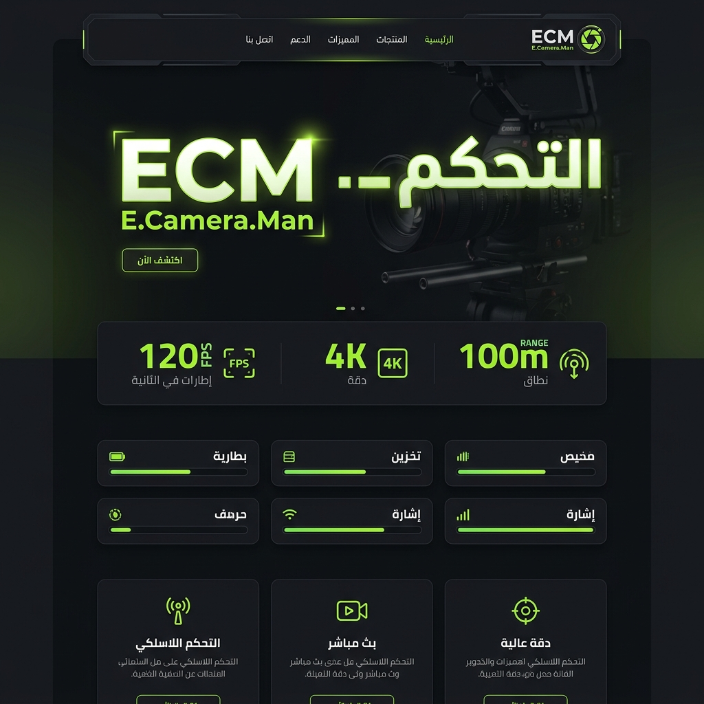

# 🎬 ECM — E.Camera.Man WordPress Theme

<p align="center">
  <strong>Version 2.0.0</strong> · Dark · RTL · Elementor Ready
</p>

---

## 📸 بريفيو الثيم



---

## 🚀 بدء سريع

1. **حمّل الثيم** → ارفعه من `المظهر > ثيمات > رفع ثيم` في WordPress
2. **فعّل الثيم** من لوحة التحكم
3. **خصّص** من `المظهر > تخصيص > 🎬 ECM Theme Settings`
4. **ابني صفحاتك** بـ Elementor مع الـ Widgets الجاهزة

---

## 📖 الـ Documentation

| الدليل | الوصف |
|--------|-------|
| [docs/index.md](docs/index.md) | 📋 الصفحة الرئيسية للتوثيق |
| [docs/installation.md](docs/installation.md) | ⬇️ دليل التثبيت والإعداد الأولي |
| [docs/customizer.md](docs/customizer.md) | 🎨 كل إعدادات الـ Customizer |
| [docs/design-tokens.md](docs/design-tokens.md) | 🎯 متغيرات CSS والألوان |
| [docs/widgets.md](docs/widgets.md) | 🧩 دليل Elementor Widgets |
| [docs/file-structure.md](docs/file-structure.md) | 📁 هيكل ملفات الثيم |
| [docs/changelog.md](docs/changelog.md) | 📝 سجل التغييرات |

---

## 📁 هيكل الملفات

```
my-theme/
├── style.css               ← CSS الرئيسي + Design Tokens
├── functions.php           ← إعدادات الثيم والـ Customizer
├── header.php              ← الهيدر والنافيبار
├── footer.php              ← الفوتر
├── page.php                ← قالب الصفحات
├── single.php              ← قالب المقال الواحد
├── archive.php             ← قالب الأرشيف/التصنيفات
├── search.php              ← قالب نتائج البحث
├── 404.php                 ← صفحة الخطأ 404
├── sidebar.php             ← الشريط الجانبي
├── comments.php            ← قالب التعليقات
├── index.php               ← الصفحة الافتراضية
├── screenshot.png          ← بريفيو الثيم
├── README.md               ← (أنت هنا)
│
├── docs/                   ← 📖 التوثيق الكامل
│
├── js/
│   ├── ecm-theme.js        ← الجافاسكريبت (بدون jQuery)
│   └── ecm-customizer.js   ← Live Preview
│
└── elementor/
    ├── widget-stat-box.php  ← صندوق الإحصائيات
    ├── widget-ctrl-card.php ← كارت التحكم
    ├── widget-feat-card.php ← كارت الميزة
    ├── widget-spec-row.php  ← سطر المواصفة
    └── widget-eyebrow.php   ← النص الفرعي الصغير
```

---

## ⚡ المتطلبات

| المتطلب | الحد الأدنى | الموصى به |
|---------|------------|----------|
| WordPress | 6.0 | 6.5+ |
| PHP | 7.4 | 8.1+ |
| Elementor | اختياري | 3.18+ |

---

## 🎨 تعديل سريع للألوان

في `style.css` القسم الأول (Design Tokens):

```css
:root {
  --ecm-green:   #7ed321;    /* ← اللون الرئيسي */
  --ecm-bg-deep: #111214;    /* ← خلفية الصفحة */
  --ecm-bg-card: #1a1d22;    /* ← خلفية الكروت */
}
```

أو من **الـ Customizer** بدون لمس الكود 👆

---

## 📄 الترخيص

GNU General Public License v2 or later

---

*صنع بـ ❤️ بواسطة E.Camera.Man*
